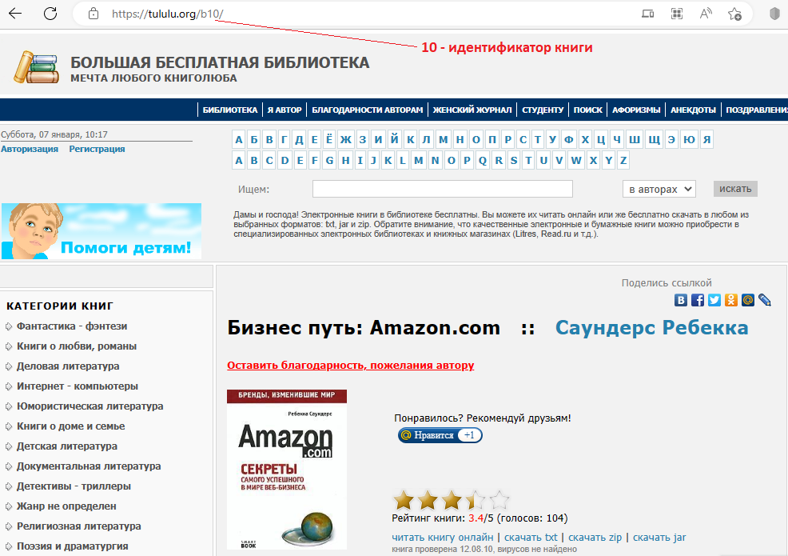

# Парсер книг с сайта tululu.org

Приложение предназначено для скачивания книг из онлайн библиотеки [tululu.org](https://tululu.org/) с целью последующего чтения в офлайн-режиме.

### Как установить

Скачайте код:
```sh
git clone https://github.com/dimsonnGH/library-parser
```
Для работы необходим Python 3 версии. Если он у вас еще не установлен, [Установите отсюда](https://www.python.org/).

Проверьте, что `python` установлен и корректно настроен. Запустите его в командной строке:
```sh
python --version
```
Рекомендуется запускать приложение в виртуальном окружении. Чтобы его создать, выполните в каталоге проекта:
```sh
python -m venv venv
```
Активируйте его. На разных операционных системах это делается разными командами:
- Windows: `.\venv\Scripts\activate`
- MacOS/Linux: `source venv/bin/activate`


Установите зависимости в виртуальное окружение:
```sh
pip install -r requirements.txt
```

### Запуск

Запуск приложения выполняется командой
```sh
python main.py --start_id <Начальный идентификатор книги> --end_id <Конечный идентификатор книги>
```
У каждой книги в библиотеке [tululu.org](https://tululu.org/) есть свой номер (идентификатор). Его можно увидеть в адресной строке на странице книги:

Параметры `--start_page` и `--end_page` указывают начальный и конечный номер из диапазона книг, которые нужно скачать. По умолчанию оба номера равны 1.
Тексты книг сохраняются во вложенную папку `books` в файлы вида `[Идентификатор].[Название].txt`.
Изображения обложек книг сохраняются во вложенную папку `imgs`. Имя файла обложки содержит идентификатор книги.

### Цель проекта

Код написан в образовательных целях на онлайн-курсе для веб-разработчиков [dvmn.org](https://dvmn.org/).